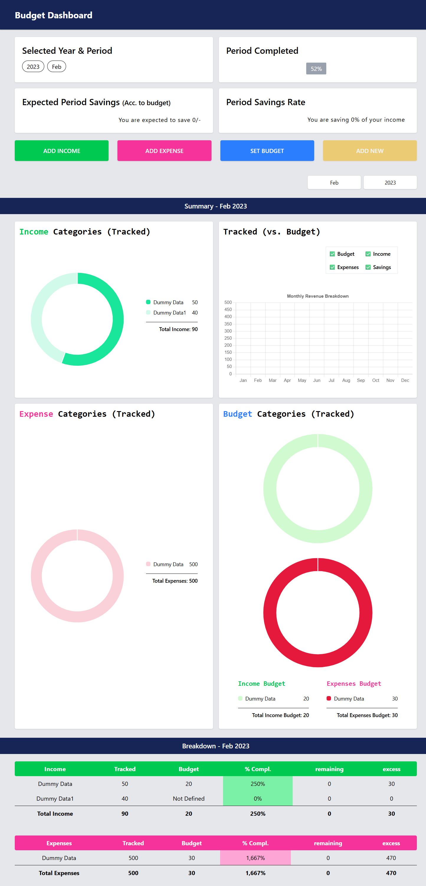

# FinanceFlow Dashboard 💰

A modern, responsive personal finance dashboard built with React that helps you plan monthly budgets and track actual spending patterns. Born from the frustration of managing finances in Excel spreadsheets!



## 🌟 Features

- **📊 Monthly Budget Planning**: Set income and expense budgets for each month
- **💳 Real-time Expense Tracking**: Track actual income and expenses as they happen
- **📈 Visual Comparisons**: Side-by-side charts comparing planned vs actual spending
- **📱 Responsive Design**: Works seamlessly on desktop, tablet, and mobile devices
- **🎯 Smart Insights**: Calculate savings rate, budget completion percentage, and financial health
- **🔄 Month Navigation**: Switch between different months to view historical data
- **📋 Detailed Breakdown**: Comprehensive tables showing budget vs actual performance

## 🛠️ Tech Stack

- **Frontend Framework**: React.js
- **Styling**: Tailwind CSS
- **Charts & Visualization**: Chart.js (react-chartjs-2)
- **State Management**: React Hooks (useState)
- **Data Storage**: Local state (Frontend only - Backend coming soon!)

## 🚀 Getting Started

### Prerequisites

- Node.js (v14 or higher)
- npm or yarn package manager

### Installation

1. **Clone the repository**
   ```bash
   git clone https://github.com/Saqib7865-dev/Personal-Finance-Dashboard-Budget-Tracker.git
   cd financeflow-dashboard
   ```

2. **Install dependencies**
   ```bash
   npm install
   # or
   yarn install
   ```

3. **Start the development server**
   ```bash
   npm start
   # or
   yarn start
   ```

4. **Open your browser**
   Navigate to `http://localhost:3000` to view the application

## 📖 How to Use

### 1. **Select Month & Year**
- Choose the month and year you want to manage
- If no data exists for that period, you'll see an "Add New" button

### 2. **Create New Budget**
- Click "Add New" to create a budget for the selected month
- This initializes the period with dummy data that you can customize

### 3. **Set Your Budget**
- **Add Income**: Click "Add Income" to set expected income sources and amounts
- **Add Expenses**: Click "Add Expense" to plan your spending categories
- **Set Budget**: Click "Set Budget" to define target amounts for each category

### 4. **Track Reality**
- As the month progresses, update your actual income and expenses
- The dashboard automatically calculates variances and savings rate

### 5. **Analyze Performance**
- View charts comparing planned vs actual spending
- Check your savings rate and budget completion percentage
- Identify spending patterns and areas for improvement

## 📊 Dashboard Components

### Overview Cards
- **Selected Period**: Current month/year being viewed
- **Period Completed**: Percentage of month elapsed
- **Expected Savings**: Planned savings based on budget
- **Actual Savings Rate**: Real savings as percentage of income

### Visual Analytics
- **Income Categories**: Donut chart showing income breakdown
- **Expense Categories**: Donut chart showing spending patterns
- **Budget vs Actual**: Comparative charts for quick insights
- **Monthly Trends**: Bar chart showing financial patterns over time

### Detailed Tables
- **Income Breakdown**: Tracked vs budgeted income with variance analysis
- **Expense Breakdown**: Tracked vs budgeted expenses with performance metrics

## 🎯 Key Insights

The dashboard helps answer important financial questions:
- Am I spending more than I planned?
- Which categories am I consistently over/under budget?
- What's my actual savings rate vs my goal?
- How does this month compare to previous months?

## 🔮 What's Next

Currently working on **backend integration** to add:
- **🔐 User Authentication**: Secure user accounts and login system
- **💾 Database Integration**: Persistent data storage with full CRUD operations
- **👤 Multi-user Support**: Individual user accounts with private financial data

## 📧 Contact

**Saqib Ali** - [@saqib7865-dev](https://github.com/saqib7865-dev)

Project Link: [Personal-Finance-Dashboard-Budget-Tracker](https://github.com/Saqib7865-dev/Personal-Finance-Dashboard-Budget-Tracker.git)

## 🙏 Acknowledgments

- Built with love for the personal finance community
- Special thanks to the React and Chart.js communities

## 📈 Project Status

**Current**: Frontend-only application with local state management  
**Next Phase**: Backend development for user authentication and data persistence  
**Vision**: Complete personal finance management solution

---

### ⭐ If this project helped you, please give it a star! It means a lot and helps others discover the project.

### 🔗 Connect with me:
- [GitHub](https://github.com/saqib7865-dev)
- [LinkedIn](https://www.linkedin.com/in/saqib-ali-350410237)

---

*Made with ❤️ and lots of ☕*